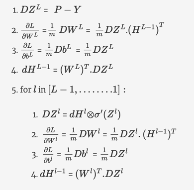

### Problem Statement 

This assignment calls for building a complete neural network using Numpy. It implements all the steps required to build a network - *feedforward, loss computation, backpropagation, weight updates* etc.

The assignment has provided with some starter code and the solution has been coded in cells marked '#Graded' .

The training is done using the MNIST dataset to classify handwritten digits between 0-9.
 
The assignment is divided into the following sections:

    Data preparation
    Feedforward
    Loss computation
    Backpropagation
    Parameter updates
    Model training and predictions

### Data Preparation

No new code was written for this part.

Firstly, we load the data using the function load_data(). The function data_wrapper() is then applied to the data to get the train and test data in the desired shape. Please note that the code needs to take a batch of data points as the input. Hence, be careful while checking the dimensions.

There are 28x28 greyscale images in the MNIST dataset. Hence, each input image is a vector of length 784. The ground truth labels of a batch are stored in a matrix which is converted to a one-hot matrix. Also, the output of the model is a softmax output of length 10. 

Hence, we have the following:

train_set_x shape: (784, 50000)
train_set_y shape: (10, 50000)
test_set_x shape: (784, 10000)
test_set_y shape: (10, 10000)

### Feedforward 

There are functions assigned to different subparts of feedforward. 

    * The whole data is taken as one batch. No minibatch gradient descent is performed.
    * The cumulative input to the layer Zl is now a step in feedforward
    * The output of the last layer is denoted as HL instead of P where layer L is the final output layer. Hence, there are L−1 hidden layers.
    * For each layer l, the Zl is stored as 'activation_memory' and Hl−1, Wl, bl are stored as 'linear_memory' to use later in backpropagation

Summarization of the **feedforward** algorithm as above:

    H0=B
    for l in [1,2,.......,L−1]:
        Zl=Wl.Hl−1+bl
        Hl=σ(Zl)
    HL = softmax(WL.HL−1+bL)

Summarization of all the functions defined in **feedforward**:
| Function | Arguments | Returns | Explanation |
|----------|-----------|---------|-------------|
| sigmoid | Z | H, sigmoid_memory | Applies sigmoid activation on Z to calculate H. Returns H, sigmoid_memory = Z  (Step 2.2) |
| relu | Z | H, relu_memory | Applies relu activation on Z to calculate H. Returns H, relu_memory = Z  (Step 2.2) |
| softmax | Z | H, softmax_memory | Applies softmax activation on Z, i.e raise to an exponent and then normalize to get H. Returns H, softmax_memory = Z (Step 2.2) |
| initialize_parameters | dimensions | W and b for all the layers | Runs a for loop to initialize the W and b of all the layers stored as dictionary parameters |
| layer_forward | H_prev, W, b, activation | H, memory | Performs Step 2 Computes Z  using step 2.1 and stores Z as linear_memory and then computes H, activation_memory  using Z as input into the activation functions defined above. Check the arguments and returns of relu, sigmoid, softmax to define this function. Returns H & memory = (linear_memory, activation_memory) |
| L_layer_forward | X, parameters | HL, memories | Uses parameters initialized by initialize_parameters and performs feedforward using layer_forward in a 'for loop' for all layers. Appends memory for each layer to memories. layer_forward for the last layer is performed outside the loop since the activation function for all layers is relu except for the last layer (which is softmax). Returns the network output HL and memories (Steps 1 to 3) |

### Loss Calculation

The loss used for multiclass classification is the cross-entropy loss.
| Function | Arguments | Returns | Explanation |
|----------|-----------|---------|-------------|
| compute_loss	| HL, Y	| loss	| It returns loss as the average of the loss of all data points. HL and Y are matrices. Hence, *loss  = 
-1.*average of the sum of all the elements of the matrix Ylog(HL) multiplied element-wise.* |

### Backpropagation

To summarise, the important points to keep in mind are:
    * The parameters dictionary is getting updated in place at each step.
    * The memories from **L_layer_forward** consisting of the tuple memory = (linear_memory, activation_memory) for each layer is used in backpropagation
    The backpropagation process will run in a loop from the last layer to the first, and each loop will compute the gradients for **Z,H,W,b**.

The **backpropagation** algorithm pseudocode is as follows:

Summarization of all functions defined in **backpropagation**:
| Function | Arguments | Returns | Explanation |
|----------|-----------|---------|-------------|
| sigmoid_backward |dH, sigmoid_memory | dZ | Z = sigmoid_memory (stored during feedforward); uses this Z and dH to calculate the gradient dZ (Step 5.1) |
| relu_backward	| dH, relu_memory| dZ | Z = relu_memory (stored during feedforward); uses this Z and dH to calculate the gradient dZ (Step 5.1) |
| layer_backward | dH, memory, activation| dH_prev, dW, db| Performs Steps 5.1 to 5.4. Calculates dZ using activation_backward and then uses dZ to calculate dH_prev, dW, db using equations in steps 5.2 to 5.4. |
| L_layer_backward | HL, Y, memories | gradients | Uses **layer_backward** in a 'for loop' using relu activation to get gradients  *dH_prev, dW, db* stored in a dictionary gradients. Note that the backprop for the last laye (Steps 1 to 4) is calculated outside and before the for loop. Returns gradients which has *dH, dW, db* for all the layers. |

### Assignment Flow

### Parameter Updates
| Function | Arguments | Returns | Explanation |
|----------|-----------|---------|-------------|
| update_parameters	| parameters, gradients, learning_rate	| parameters *parameters* has the parameters which is updated using the *learning_rate* and the gradients stored in *gradients*. |

### Model Training
This is the final step in which all the functions created above are combined to define an 'L_layer_model'. 
| Function | Arguments | Returns | Explanation |
|----------|-----------|---------|-------------|
| L_layer_model	| X, Y, dimensions, learning_rate , num_iterations, print_loss | parameters	| Initializes parameters with **initialize_parameters**. In a for loop uses functions **L_layer_forward, compute_loss, L_layer_backward, update_parameters** in the specified order.|

**Important Note on Training**
The training will take about 10-20 minutes with about 2000 iterations, which is a recommended number to achieve good accuracy (> 75%).
