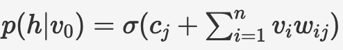

In this assignment, we shall create a function to perform Gibbs sampling k times within contrastive divergence often referred to as CD-k. Let's understand the structure of the notebook and the CD-k training process:

* Importing the dataset.
* Create a bag of words model.
Note that the shape of a bag of words model will be (data_size, vocablury_size)
Please note that the above shape might vary with the way you perform bag of words model but the index data_size will be the same.
* Training using CD-k. This involves performing Gibbs sampling k-times which can be better understood using the following image. 

1. You start with the input batch of data, v0. 
2. You then calculate   Vectorized implementation: p(h|v0)=σ(C + V.W)
3. Using this p(h|v0), you sample h0.
4. Now that you have got h0, you calculate
  Vectorized implementation: p(v|h0)=σ(B+H.WT)
5. Using this p(v|h0), you sample v1.

You repeat this k times till you get hk and vk.

Step 2 and 3 are performed in the function *sampleHiddenLayer()* while Step 4 and 5 are performed in *sampleVisibleLayer()*. 

*sampleHiddenLayer()* and *sampleVisibleLayer()* are combined to create a function *gibbs()* which does one iteration of Gibbs sampling.

gibbs is repeated k-times in the function *cd_k()* to perform Contrastive Divergence k-times.

To maximize the joint probability distribution, using the energy function as defined in the above sampling process, the update matrices and vectors simplify as follows:

1. ΔW = v0 ⊗ p(h0|v0) − vk⊗p(hk|vk)
2. Δb = avg_across_batch(vo−vk)
3. Δc = avg_across_batch(p(h0|vo)−p(hk|vk))

You do average across batch because you need a vector update for the bias vectors and vo,k and p(h0|vo),p(hk|vk) are matrices.

Since we have to maximize the joint probability distribution, we use gradient ascent here with momentum.

The momentum equations are as follows:

1. mWt=γ mWt−1 − ΔW
2. mbt=γ mbt−1 − Δb
3. mct=γ mct−1 − Δc

γ is the momentum coefficient here.

Using these momentum terms, you update the weights and biases as follows:

1. Wt = Wt−1 + α mWt
2. bt = bt−1 + α mbt
3. ct = ct−1 + α mct

α is the learning rate.

The above equations are implemented in the function *train()*.

